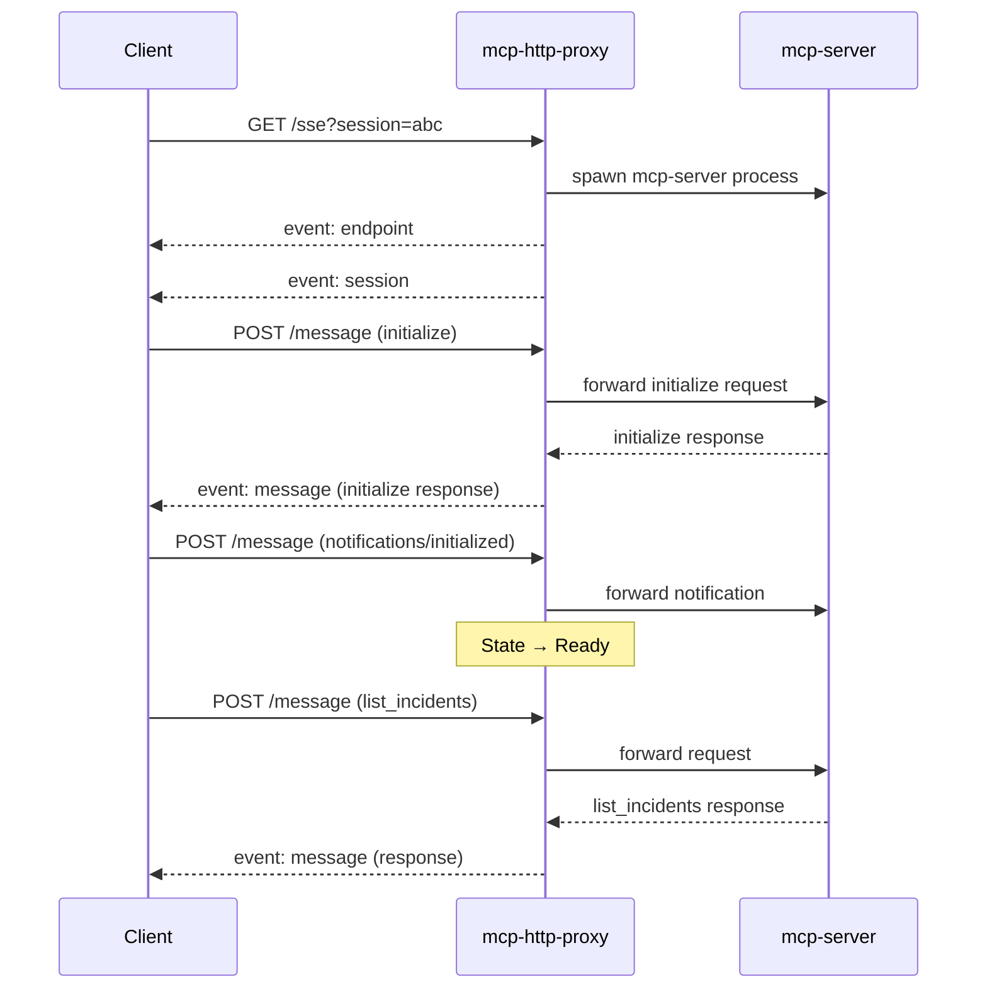

# MCP HTTP/SSE Server Guide

## Overview

The incident.io MCP server supports two transport modes:

1. **stdio mode** (default) - Standard input/output for local MCP clients like Claude Desktop
2. **HTTP/SSE mode** - HTTP Server-Sent Events transport for remote/web-based MCP clients

This guide covers the HTTP/SSE server implementation, including architecture, building, and deployment.

---

## Architecture

### Design Rationale

The HTTP server implementation uses a **proxy architecture** to bridge HTTP/SSE transport with the native stdio MCP server:

```
┌─────────────────┐         ┌──────────────────┐         ┌─────────────────┐
│   MCP Client    │◄───────►│  mcp-http-proxy  │◄───────►│   mcp-server    │
│  (Web/Remote)   │  HTTP   │   (Translator)   │  stdio  │  (Core Logic)   │
└─────────────────┘   SSE   └──────────────────┘         └─────────────────┘
```

**Why this architecture?**

1. **Separation of Concerns**: Core MCP logic (`mcp-server`) remains transport-agnostic
2. **Code Reuse**: Same business logic serves both stdio and HTTP clients
3. **Protocol Translation**: `mcp-http-proxy` handles the complexity of:
   - HTTP request/response lifecycle
   - Server-Sent Events streaming
   - Session management and cleanup
   - Protocol state tracking (initialize → initialized → ready)
4. **Scalability**: Proxy can manage multiple concurrent sessions independently

### Components

#### 1. mcp-server (stdio)
- Core MCP protocol implementation
- incident.io API integration
- Tool implementations (list_incidents, create_incident, etc.)
- Reads JSON-RPC from stdin, writes responses to stdout

#### 2. mcp-http-proxy
- HTTP/SSE transport layer (`mcp-http-proxy.go:550`)
- Session lifecycle management with reference counting
- Process spawning and supervision
- Protocol state machine enforcement

**Key Features:**
- **Session Management**: Creates isolated `mcp-server` process per session
- **Reference Counting**: Tracks active client connections, cleans up when zero
- **Protocol State Tracking**: Enforces MCP initialization flow
- **Concurrent Initialize Protection**: Prevents race conditions during initialization
- **Graceful Cleanup**: Waits for goroutines before closing channels

#### 3. entrypoint.sh
- Mode selector based on `MCP_TRANSPORT_MODE` environment variable
- Supports: `stdio`, `http`, `sse` (http and sse are equivalent)

---

## Building Multi-Architecture Images

### Prerequisites

```bash
# Enable Docker buildx (if not already enabled)
docker buildx create --name multiarch --use
docker buildx inspect --bootstrap
```

### Build Process

The `Dockerfile` creates a unified image that supports both stdio and HTTP modes via the entrypoint script.

#### Single Architecture Build

```bash
# Build for current platform
docker build -t incidentio-mcp:latest .
```

#### Multi-Architecture Build

```bash
# Build for multiple architectures and push to registry
docker buildx build \
  --platform linux/amd64,linux/arm64 \
  --tag 439508887365.dkr.ecr.us-east-1.amazonaws.com/incidentio-mcp:v0.0.1 \
  --push \
  .
```

**Supported Platforms:**
- `linux/amd64` - x86_64 processors (Intel, AMD)
- `linux/arm64` - ARM64 processors (Apple Silicon, AWS Graviton)

#### Create Multi-Arch Manifest (Alternative)

If building separate images for each platform:

```bash
# Build and tag for each architecture
docker buildx build \
  --platform linux/amd64 \
  --tag 439508887365.dkr.ecr.us-east-1.amazonaws.com/incidentio-mcp:v0.0.1-amd64 \
  --push \
  .

docker buildx build \
  --platform linux/arm64 \
  --tag 439508887365.dkr.ecr.us-east-1.amazonaws.com/incidentio-mcp:v0.0.1-arm64 \
  --push \
  .

# Create and push manifest
docker buildx imagetools create \
  --tag 439508887365.dkr.ecr.us-east-1.amazonaws.com/incidentio-mcp:v0.0.1 \
  439508887365.dkr.ecr.us-east-1.amazonaws.com/incidentio-mcp:v0.0.1-amd64 \
  439508887365.dkr.ecr.us-east-1.amazonaws.com/incidentio-mcp:v0.0.1-arm64
```

**When to use `imagetools create`:**
- Combining separately built architecture-specific images
- Creating multi-arch manifests post-build
- Registry doesn't support direct multi-platform push

---

## Running the Server

### stdio Mode Compatibility

The unified image fully supports stdio mode for use with MCP clients like Claude Desktop:

**Verification:**
```bash
# Test stdio protocol
echo '{"jsonrpc":"2.0","id":1,"method":"initialize","params":{"protocolVersion":"2024-11-05","capabilities":{},"clientInfo":{"name":"test","version":"1.0"}}}' | \
  docker run --rm -i -e MCP_TRANSPORT_MODE=stdio -e INCIDENT_IO_API_KEY=test incidentio-mcp:latest
```

**Expected output:**
```json
{"jsonrpc":"2.0","result":{"capabilities":{"tools":{"listChanged":false}},"protocolVersion":"2024-11-05","serverInfo":{"name":"incidentio-mcp-server","version":"1.0.0"}},"id":1}
```

**Claude Desktop configuration:**
```json
{
  "mcpServers": {
    "incidentio": {
      "command": "docker",
      "args": ["run", "--rm", "-i", "-e", "MCP_TRANSPORT_MODE=stdio", "incidentio-mcp:latest"],
      "env": {
        "INCIDENT_IO_API_KEY": "your-api-key"
      }
    }
  }
}
```

### HTTP Server Mode

### Basic Usage

```bash
# HTTP mode (default)
docker run --rm -p 8080:8080 \
  -e INCIDENT_IO_API_KEY="your-api-key-here" \
  incidentio-mcp:latest

# stdio mode
docker run --rm \
  -e MCP_TRANSPORT_MODE=stdio \
  -e INCIDENT_IO_API_KEY="your-api-key-here" \
  incidentio-mcp:latest
```

### Production Configuration

```bash
docker run --rm \
  -p 8080:8080 \
  -u 1001:1001 \
  -e MCP_TRANSPORT_MODE=http \
  -e INCIDENT_IO_API_KEY="$(cat /path/to/incident_key.txt)" \
  -e MCP_DEBUG=1 \
  -e INCIDENT_IO_DEBUG=1 \
  439508887365.dkr.ecr.us-east-1.amazonaws.com/incidentio-mcp:v0.0.1
```

**Parameter Breakdown:**

| Flag/Env Variable | Purpose | Default |
|-------------------|---------|---------|
| `-p 8080:8080` | Expose HTTP server port | 8080 |
| `-u 1001:1001` | Run as non-root user for security | root |
| `MCP_TRANSPORT_MODE` | Set transport mode (stdio/http/sse) | http |
| `INCIDENT_IO_API_KEY` | incident.io API authentication | (required) |
| `MCP_HTTP_PORT` | HTTP server listen port | 8080 |
| `MCP_DEBUG` | Enable MCP protocol debug logging | (disabled) |
| `INCIDENT_IO_DEBUG` | Enable incident.io API debug logging | (disabled) |

### Alternative Entrypoint Override

For debugging or custom startup:

```bash
docker run --rm \
  -p 8080:8080 \
  -u 1001:1001 \
  -e MCP_TRANSPORT_MODE=http \
  -e INCIDENT_IO_API_KEY="$(cat /tmp/incident_key.txt)" \
  -e MCP_DEBUG=1 \
  -e INCIDENT_IO_DEBUG=1 \
  --entrypoint /bin/bash \
  439508887365.dkr.ecr.us-east-1.amazonaws.com/incidentio-mcp:v0.0.1 \
  -c "/app/entrypoint.sh"
```

**Why override entrypoint?**
- Interactive debugging: `--entrypoint /bin/bash` (no `-c` flag)
- Custom startup scripts
- Running multiple commands in sequence

---

## HTTP/SSE Endpoints

The proxy server exposes three endpoints:

### 1. `/sse` - Server-Sent Events Stream

Establishes a persistent connection for receiving MCP messages.

**Request:**
```bash
GET /sse?session=my-session-id
```

**Response Headers:**
```
Content-Type: text/event-stream
Cache-Control: no-cache
Connection: keep-alive
```

**Event Types:**
- `endpoint` - Message POST endpoint URL
- `session` - Session ID confirmation
- `message` - MCP JSON-RPC messages
- (keepalive) - Periodic keepalive (every 30s)

**Example:**
```bash
curl -N http://localhost:8080/sse?session=test-session
```

### 2. `/message` - Send Messages

POST JSON-RPC messages to the MCP server.

**Request:**
```bash
POST /message?session=my-session-id
Content-Type: application/json

{
  "jsonrpc": "2.0",
  "id": 1,
  "method": "initialize",
  "params": {
    "protocolVersion": "2024-11-05",
    "capabilities": {},
    "clientInfo": {
      "name": "test-client",
      "version": "1.0.0"
    }
  }
}
```

**Response:**
```json
{"status": "sent"}
```

**Notes:**
- Responses arrive via `/sse` stream, not HTTP response
- `ping` method handled directly by proxy (doesn't forward to mcp-server)

### 3. `/health` - Health Check

Basic health check endpoint.

**Request:**
```bash
GET /health
```

**Response:**
```json
{
  "status": "healthy",
  "sessions": 2
}
```

---

## Protocol Flow

### Initialization Sequence



### State Machine

The proxy enforces MCP protocol state transitions:

1. **Uninitialized** → `initialize` allowed
2. **Initializing** → wait for `initialize` response
3. **Ready** → `notifications/initialized` + all other methods allowed

**State Validation:**
- Rejects out-of-order requests with error `-32002`
- Prevents concurrent `initialize` requests with error `-32001`
- Validates method availability based on current state

---

## Session Management

### Lifecycle

1. **Creation**: Client connects to `/sse`, proxy spawns `mcp-server` process
2. **Active**: Multiple clients can share a session (reference counting)
3. **Cleanup**: When last client disconnects, proxy destroys session

### Reference Counting

```go
refCount := atomic.AddInt32(&session.refCount, 1)  // Client connects
// ... client uses session ...
newRefCount := atomic.AddInt32(&session.refCount, -1)  // Client disconnects

if newRefCount == 0 {
    // Last client disconnected, clean up session
    proxy.destroySession(sessionID)
}
```

### Graceful Cleanup

Session destruction follows careful cleanup order:

1. Cancel context (signal goroutines to exit)
2. Close all pipes (unblock I/O operations)
3. Wait for goroutines (via `sync.WaitGroup`)
4. Close message channel (safe after goroutines exit)
5. Process reaping handled by background goroutine

**Why this order?**
- Prevents panics from sending to closed channels
- Ensures all readers/writers finish before cleanup
- Avoids zombie processes

---

## Security Considerations

### Non-Root User

The HTTP server image includes a non-root user (`incidentio:1001`):

```bash
# Run as non-root user
docker run -u 1001:1001 ...
```

**Benefits:**
- Limits damage from container escape
- Follows principle of least privilege
- Prevents accidental file permission issues

### API Key Management

**Best Practices:**

1. **External Secrets**: Load from file, not inline
   ```bash
   -e INCIDENT_IO_API_KEY="$(cat /path/to/secret.txt)"
   ```

2. **Secret Management**: Use Docker secrets, Kubernetes secrets, or vault
   ```bash
   docker run --secret incident-io-key ...
   ```

3. **Avoid Command History**: Don't pass keys directly in command
   ```bash
   # BAD: visible in process list and shell history
   -e INCIDENT_IO_API_KEY="sk-abc123..."
   ```

### Network Isolation

```bash
# Restrict to localhost only
docker run -p 127.0.0.1:8080:8080 ...

# Or use Docker networks for inter-container communication
docker network create mcp-network
docker run --network mcp-network ...
```

---

## Debugging

### Enable Debug Logging

```bash
docker run --rm -p 8080:8080 \
  -e MCP_DEBUG=1 \
  -e INCIDENT_IO_DEBUG=1 \
  incidentio-mcp:http-server
```

**Output:**
- MCP protocol messages (requests/responses)
- incident.io API calls and responses
- Session lifecycle events
- Error details and stack traces

### Interactive Shell

```bash
# Start container with bash shell
docker run --rm -it \
  -p 8080:8080 \
  -e INCIDENT_IO_API_KEY="your-key" \
  --entrypoint /bin/bash \
  incidentio-mcp:http-server

# Inside container:
/app $ ls -la
/app $ cat entrypoint.sh
/app $ /app/mcp-http-proxy --help
/app $ /app/mcp-server --help
```

### Test Endpoints

```bash
# Health check
curl http://localhost:8080/health

# SSE stream (leave running in terminal)
curl -N http://localhost:8080/sse?session=test

# Send initialize (in another terminal)
curl -X POST http://localhost:8080/message?session=test \
  -H "Content-Type: application/json" \
  -d '{
    "jsonrpc": "2.0",
    "id": 1,
    "method": "initialize",
    "params": {
      "protocolVersion": "2024-11-05",
      "capabilities": {},
      "clientInfo": {"name": "curl", "version": "1.0"}
    }
  }'
```

### Common Issues

#### Port Already in Use
```bash
# Check what's using port 8080
lsof -i :8080
netstat -tuln | grep 8080

# Use different port
docker run -p 9090:8080 -e MCP_HTTP_PORT=8080 ...
```

#### Permission Denied
```bash
# Ensure user 1001 has necessary permissions
docker run -u 1001:1001 ...

# Or run as root (development only)
docker run -u 0:0 ...
```

#### Session Not Found
- Check session ID matches between `/sse` and `/message` calls
- Ensure SSE connection is active before sending messages
- Session cleaned up after last client disconnects

---

## Deployment Examples

### Docker Compose

```yaml
version: '3.8'
services:
  mcp-http:
    image: 439508887365.dkr.ecr.us-east-1.amazonaws.com/incidentio-mcp:v0.0.1
    ports:
      - "8080:8080"
    user: "1001:1001"
    environment:
      - MCP_TRANSPORT_MODE=http
      - MCP_HTTP_PORT=8080
      - MCP_DEBUG=0
      - INCIDENT_IO_DEBUG=0
    secrets:
      - incident_io_api_key
    restart: unless-stopped

secrets:
  incident_io_api_key:
    file: ./incident_key.txt
```

### Kubernetes

```yaml
apiVersion: apps/v1
kind: Deployment
metadata:
  name: incidentio-mcp-http
spec:
  replicas: 3
  selector:
    matchLabels:
      app: incidentio-mcp
  template:
    metadata:
      labels:
        app: incidentio-mcp
    spec:
      securityContext:
        runAsUser: 1001
        runAsGroup: 1001
        fsGroup: 1001
      containers:
      - name: mcp-http
        image: 439508887365.dkr.ecr.us-east-1.amazonaws.com/incidentio-mcp:v0.0.1
        ports:
        - containerPort: 8080
          name: http
        env:
        - name: MCP_TRANSPORT_MODE
          value: "http"
        - name: MCP_HTTP_PORT
          value: "8080"
        - name: INCIDENT_IO_API_KEY
          valueFrom:
            secretKeyRef:
              name: incident-io-credentials
              key: api-key
        livenessProbe:
          httpGet:
            path: /health
            port: 8080
          initialDelaySeconds: 10
          periodSeconds: 30
        readinessProbe:
          httpGet:
            path: /health
            port: 8080
          initialDelaySeconds: 5
          periodSeconds: 10
---
apiVersion: v1
kind: Service
metadata:
  name: incidentio-mcp-http
spec:
  selector:
    app: incidentio-mcp
  ports:
  - port: 80
    targetPort: 8080
  type: ClusterIP
```

### AWS ECS

```json
{
  "family": "incidentio-mcp-http",
  "networkMode": "awsvpc",
  "containerDefinitions": [
    {
      "name": "mcp-http",
      "image": "439508887365.dkr.ecr.us-east-1.amazonaws.com/incidentio-mcp:v0.0.1",
      "portMappings": [
        {
          "containerPort": 8080,
          "protocol": "tcp"
        }
      ],
      "environment": [
        {
          "name": "MCP_TRANSPORT_MODE",
          "value": "http"
        },
        {
          "name": "MCP_HTTP_PORT",
          "value": "8080"
        }
      ],
      "secrets": [
        {
          "name": "INCIDENT_IO_API_KEY",
          "valueFrom": "arn:aws:secretsmanager:us-east-1:123456789012:secret:incident-io-api-key"
        }
      ],
      "user": "1001:1001",
      "healthCheck": {
        "command": ["CMD-SHELL", "curl -f http://localhost:8080/health || exit 1"],
        "interval": 30,
        "timeout": 5,
        "retries": 3
      }
    }
  ]
}
```

---

## Performance Considerations

### Session Isolation

Each session spawns a separate `mcp-server` process:
- **Pros**: Complete isolation, no shared state, independent crashes
- **Cons**: Higher memory usage (one Go process per session)

**Recommendation**: For high-traffic scenarios, consider:
- Session pooling/reuse
- Horizontal scaling with load balancer
- Connection limits per instance

### Resource Limits

```bash
# Limit CPU and memory
docker run --rm \
  -p 8080:8080 \
  --cpus="0.5" \
  --memory="256m" \
  -e INCIDENT_IO_API_KEY="$(cat /tmp/incident_key.txt)" \
  incidentio-mcp:http-server
```

### Concurrent Connections

Default Go HTTP server handles connections well, but consider:
- `GOMAXPROCS` for CPU-bound workloads
- Connection timeouts for idle clients
- Rate limiting for API protection

---

## Migration from stdio to HTTP

### Client Changes

**Before (stdio):**
```json
{
  "mcpServers": {
    "incidentio": {
      "command": "/path/to/mcp-server"
    }
  }
}
```

**After (HTTP):**
```json
{
  "mcpServers": {
    "incidentio": {
      "transport": "sse",
      "url": "http://localhost:8080/sse"
    }
  }
}
```

### Compatibility

The HTTP server is fully compatible with the stdio server:
- Same tool implementations
- Same API integration
- Same MCP protocol compliance

**Only difference**: Transport layer (HTTP/SSE vs stdio)

---

## Additional Resources

- [MCP Protocol Specification](https://modelcontextprotocol.io/)
- [Server-Sent Events (SSE) Spec](https://html.spec.whatwg.org/multipage/server-sent-events.html)
- [incident.io API Documentation](https://api-docs.incident.io/)
- [Docker Multi-Platform Builds](https://docs.docker.com/build/building/multi-platform/)

---

## Support

For issues or questions:
- GitHub Issues: https://github.com/incident-io/incidentio-mcp-golang/issues
- incident.io Support: support@incident.io
